# 

# `<IMERSY />`

### Desenvolvido por [Felipe Takayuki](https://github.com/Felipe-Takayuki) durante o evento *Bootcamp Jovem Programador 2024* da [UNIMAR](https://unimar.br/)

**E-mail:** [ftnaka91@gmail.com](mailto:ftnaka91@gmail.com) 

**Linkedin:** https://www.linkedin.com/in/felipe-takahashi-8b26b0281/

---

### **`Imersy`, é um projeto construído para a Unimar com o intuito de facilitar   a participação dos estudantes nos Bootcamps**

## Mas no quê o `Imersy` facilita ?

### O principal motivo para a utilização desse projeto é pela centralização dos recursos necessários, para que ocorra um Bootcamp atualmente os participantes precisam usar várias plataformas no andamento do evento tanto para se cadastrar, enviar um projeto, pegar o material da aula

---

## 📖 Sumário

- Passo a Passo
    - Front-End **(webSite)**
    - Back-End **(API)**
- Andamento do site
- Como usar o site?

---

## 👣 Passo a Passo

Requisitos obrigatórios: instalar o [node.js](https://nodejs.org/pt/download/prebuilt-installer) , [golang](https://go.dev/doc/install) e  [laragon](https://laragon.org/download/) ou [docker](https://www.docker.com/) (obs: recomendo o uso do docker)

- *Front-End:*

1 - Clone o projeto 

```bash
git clone https://github.com/Felipe-Takayuki/Imersy.git
```

2 - Entrar no diretório do front-end

```bash
cd Imersy/imersy-frontend
```

3 - Instalar os pacotes necessários

```bash
npm install
```

4 - Rodar o *front-end*

```bash
npm run dev
```

- *Back-End (Com Docker)*

1 - Iniciar o DockerHub

2 - entre no diretório 
```bash
cd Imersy/api
```

3 - Instale e inicie a api

```bash
docker compose up
```

- *Back-End*

1 - Abra o arquivo db.sql do diretório Imersy/api 

2 - Copie o conteúdo desse arquivo  e crie o banco de dados manualmente com usuario root e sem senha

3 - Entre no diretório

```bash
cd api/cmd
```

4 - Inicie a api

```bash
go run . 
```

---

## ↗️ Andamento

### O que eu fiz?

- Cadastro ,login e logout;
- Criação de projeto;
- Criação de material de Aula;
- Obtenção da lista de projetos para serem avaliados;
- Obtenção de materiais de aulas;
- Obtenção de material de aula por `id`;
- Ranking de projetos
- Avaliação de projetos pelos mentores;

### O que faltou?

- Perfil do usuário;
- Deletar projeto;
- Mostrar o rank apenas quando todos mentores avaliarem todos projetos
- Deletar material de aula;
- Envio de arquivos no projeto

### Tecnologias utilizadas

Fiz essa aplicação utilizando **React, Typescript, Vite e TailwindCSS** no front e na minha API usei **golang e mariaDB**

## 💻 Como usar o site? 
### login para os mentores
**E-mails:**
- joze@email.com
- isaac@email.com
- marco@email.com

**Senha para todos:**
admin123

<div align="center">
<h3 align="start">Está é a pagina inicial </h3>
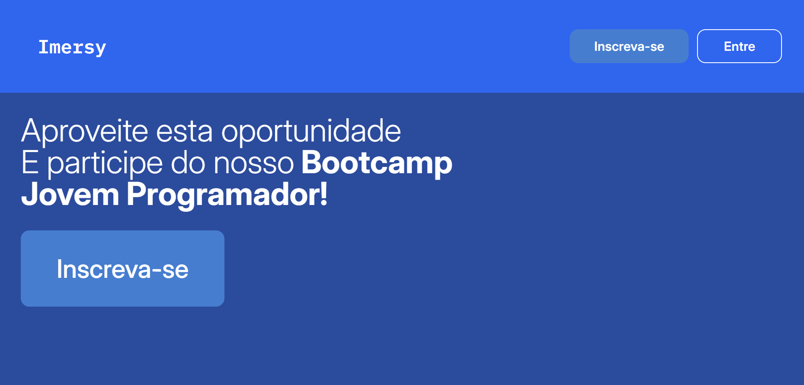
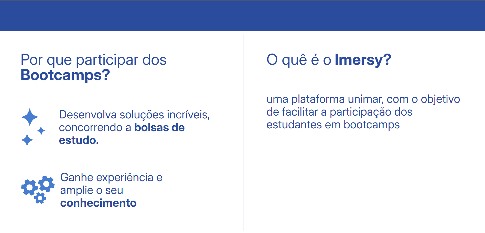

<h3 align="start">Faça login se possuir uma uma conta</h3>
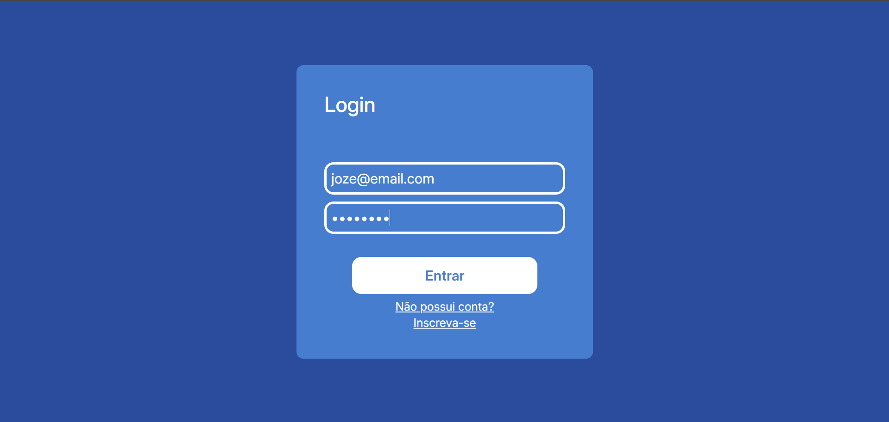

<h3 align="start">Caso não tenha conta clique em inscreva-se  </h3>
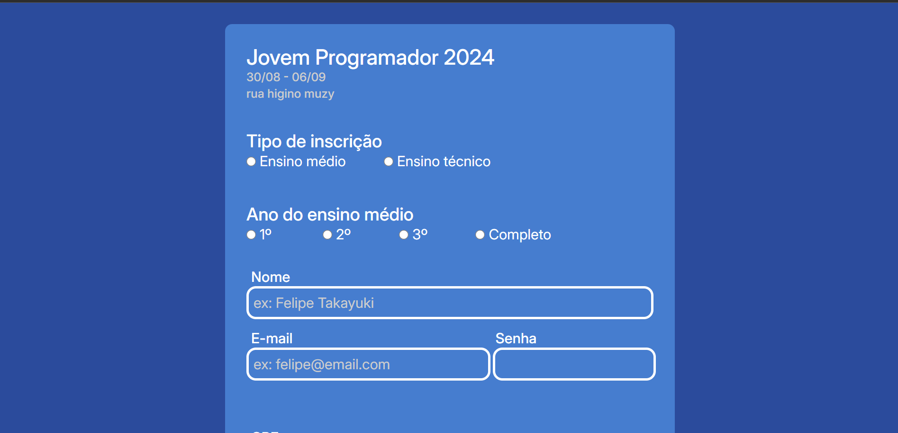
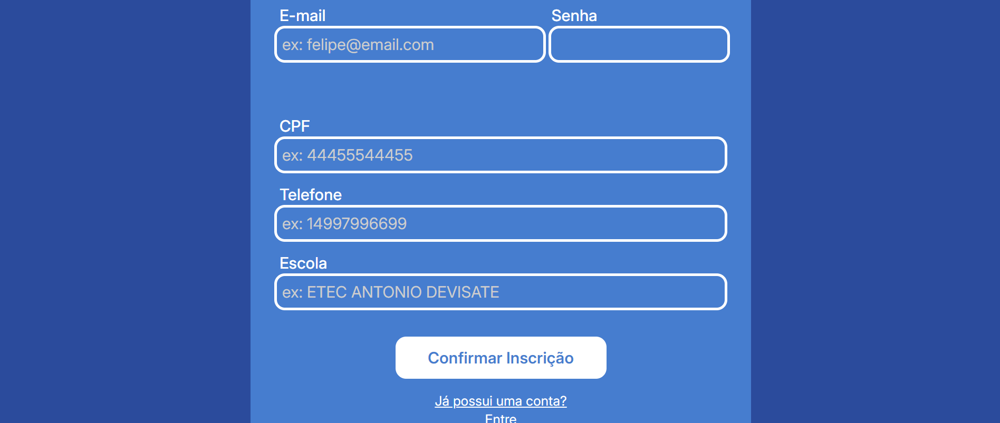

<h3 align="start">Realize o cadastro e você será redicionado a userpage</h3>
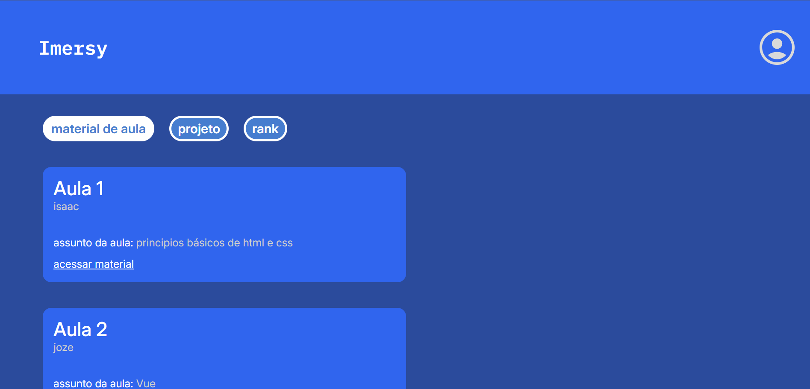


<h3 align="start">Aqui você poderá ver o material de aula </h3>


<h3 align="start">Envie e veja o seu projeto</h3>
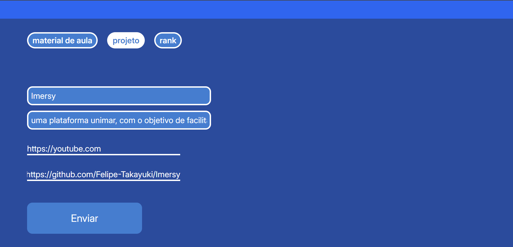
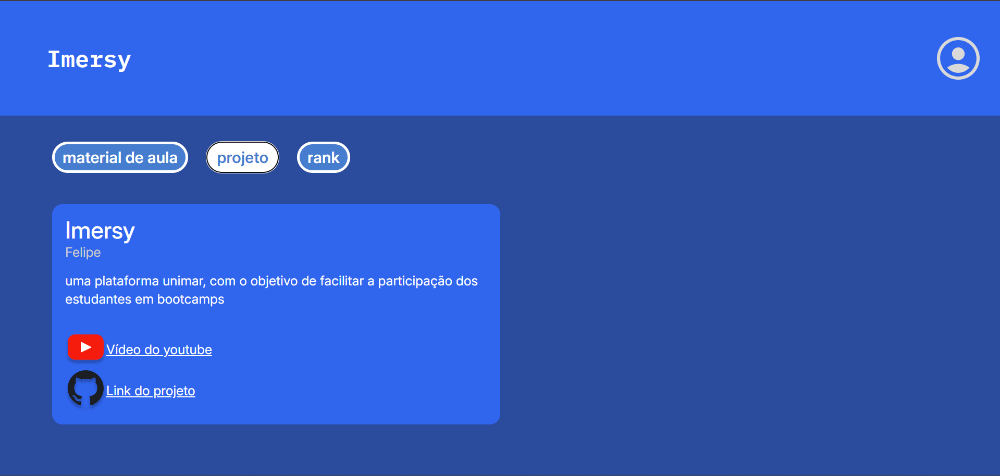

<h3 align="start">Veja o rank</h3>


<h2 align="start">Para os mentores:</h2>
<h3 align="start">Escreva o material das aulas e poste para os participantes</h3>
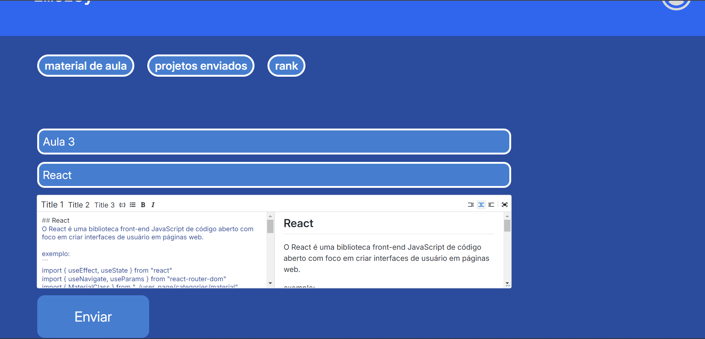
<h3 align="start">Veja os materiais que você ou os seus colegas postaram</h3>
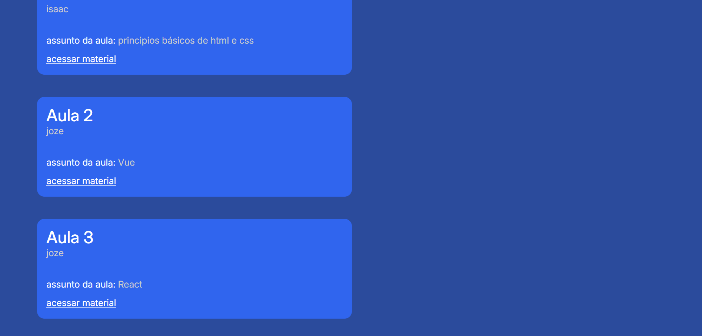
<h3 align="start">Avalie os projetos</h3>
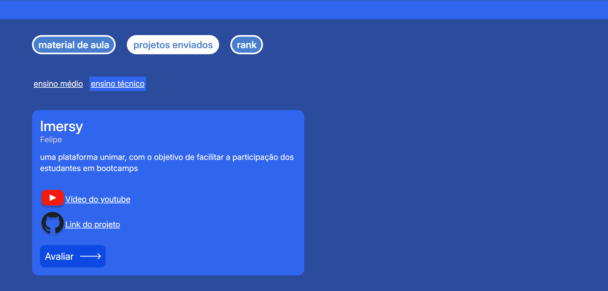
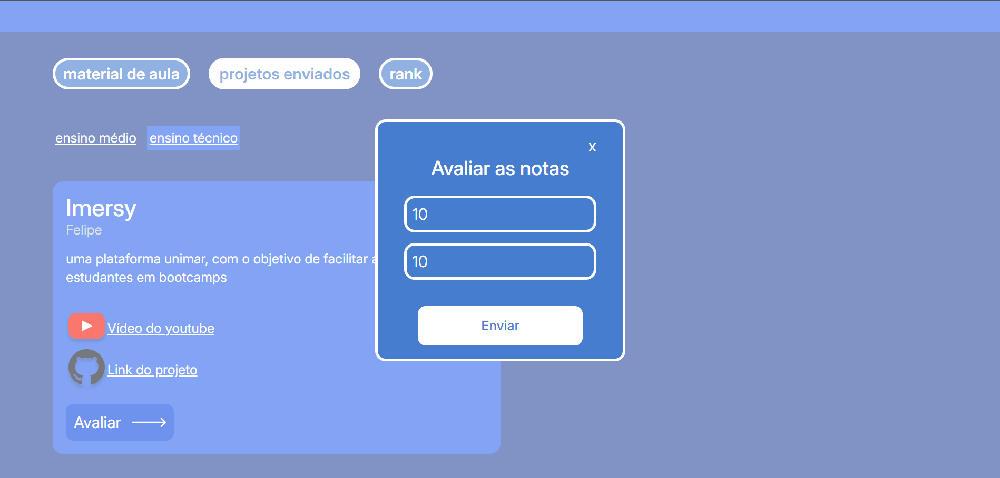
<h3 align="start">Veja no rank a média da avaliação de um projeto da sua nota com a dos outros mentores</h3>
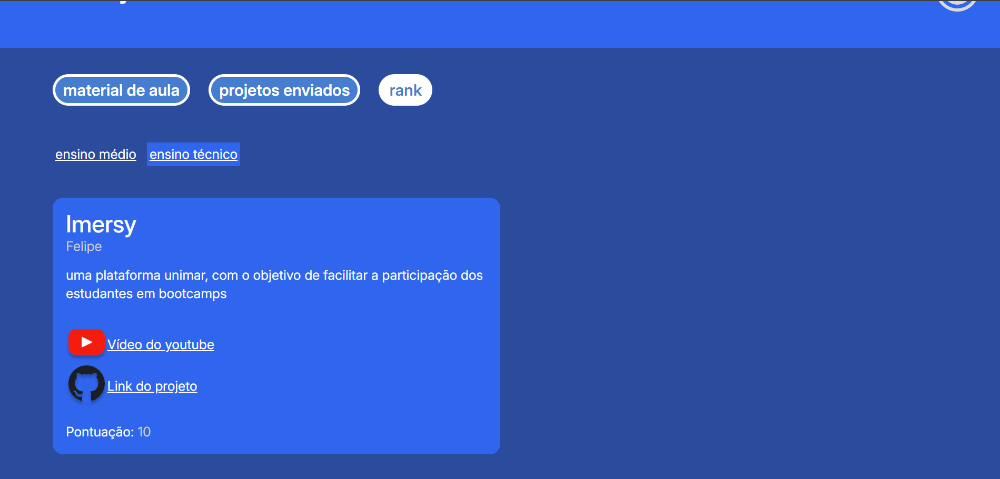

<h3 align="start">Quando cansar saia um pouco</h3>
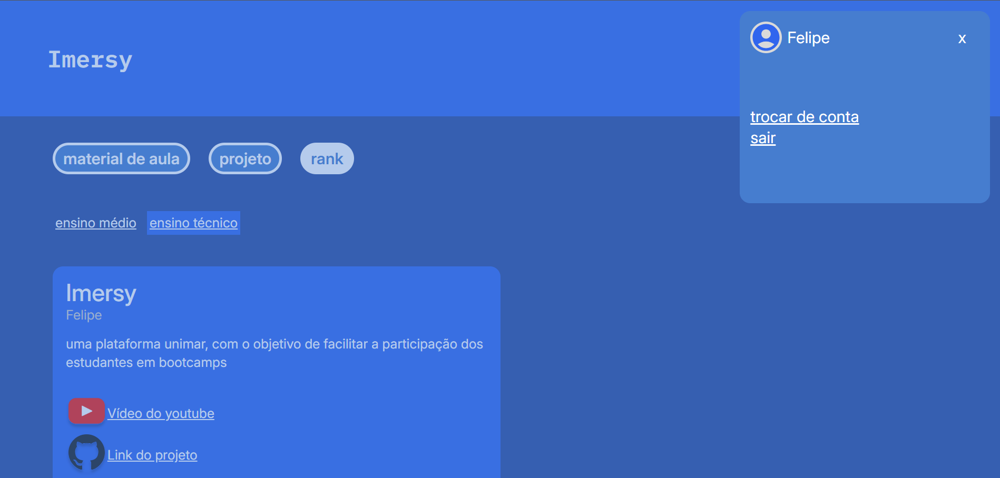


</div>

---

### Por fim gostaria de agradecer a [UNIMAR](https://unimar.br/) e aos envolvidos pela oportunidade de participar desse evento 🙏